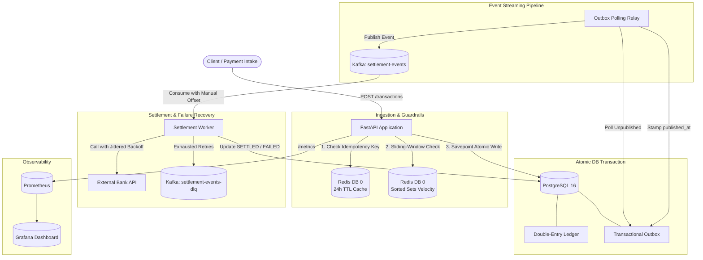

# Distributed Payment Reconciliation & Fraud Detection Engine

[](https://github.com/Tarunkumar314/payment-reconciliation-engine/actions/workflows/ci.yml)
[](https://www.python.org/downloads/)
[](https://fastapi.tiangolo.com)
[](https://kafka.apache.org/)
[](https://www.postgresql.org/)
[](https://redis.io/)
[](https://opensource.org/licenses/MIT)

A high-throughput, distributed payment processing and settlement engine built with **FastAPI**, **PostgreSQL**, **Redis**, and **Apache Kafka**. Designed with financial-grade consistency guarantees, featuring **double-entry bookkeeping**, **transactional outbox pattern**, **distributed idempotency**, **sliding-window fraud velocity controls**, and a **fault-tolerant settlement worker with exponential backoff and DLQ routing**.

---

## Architecture Overview



---

## Core Engineering Pillars & Design Rationale

### 1. Double-Entry Ledger Bookkeeping
* **Design Decision**: Every financial transaction must consist of at least two balanced entries where `SUM(debit) == SUM(credit)`. Accounts are strictly typed (`ASSET`, `LIABILITY`, `EQUITY`, `REVENUE`, `EXPENSE`).
* **What Breaks Without It**: Single-entry databases allow money to be created or destroyed due to race conditions or partial failures. Double-entry ensures mathematical balance and complete auditability.

### 2. Transactional Outbox Pattern (No Dual-Writes)
* **Design Decision**: Ledger entries and their corresponding Kafka events are written in the **exact same PostgreSQL transaction**. A dedicated background relay process polls for unpublished events, publishes to Kafka, and stamps `published_at` only after broker acknowledgement.
* **What Breaks Without It**: Directly writing to PostgreSQL and publishing to Kafka inside the HTTP request handler suffers from the "Dual-Write Problem". If Kafka is down or the network drops after the database commit, the event is permanently lost; if the database rolls back after Kafka publishes, phantom events are dispatched.

### 3. Distributed Idempotency Guard
* **Design Decision**: Incoming `Idempotency-Key` headers are cached in Redis with a 24-hour TTL. Duplicate requests immediately return the cached response without re-executing business logic or writing duplicate ledger entries.
* **What Breaks Without It**: Client retries or network timeouts would cause duplicate charges and double-debiting customer accounts.

### 4. Sliding-Window Fraud Velocity Limits
* **Design Decision**: Real-time velocity checks implemented via Redis Sorted Sets (`ZADD`, `ZREMRANGEBYSCORE`, `ZCARD`). Transactions exceeding velocity thresholds within a rolling 60-second window are automatically placed on `HELD` status.
* **What Breaks Without It**: Fixed-window rate limiters suffer from edge spikes (e.g., 2x limit at window boundaries). Sliding windows prevent card-testing attacks and rapid draining of accounts.

### 5. Resilient Settlement Worker (Retry + DLQ + Manual Offset Commits)
* **Design Decision**: The Kafka consumer uses `enable_auto_commit=False`. On transient bank errors (HTTP 503/timeouts), it retries with exponential backoff and randomized jitter. If retries are exhausted, the event is routed to a Dead Letter Queue (`settlement-events-dlq`) before committing the Kafka offset.
* **What Breaks Without It**: Auto-committing offsets on read results in silent message drops if the consumer crashes mid-processing. Retrying without jitter can trigger the "Thundering Herd" problem against the external bank API.

---

## Load Test & Performance Benchmarks

The system was benchmarked using **k6** with 50 concurrent virtual users (VUs) ramping over 30s, holding for 60s, and ramping down over 30s.

### Dual-Environment Comparison

| Metric | Local Host (Windows / WSL2) | GitHub Cloud Runner (Native Linux) | SLO Target | Status |
| :--- | :--- | :--- | :--- | :--- |
| **Total Transactions** | `7,554` | **`14,506`** | - | - |
| **Throughput** | `62.90 req/s` | **`120.83 req/s`** | > 50 req/s | **PASSED** |
| **Average Latency** | `498.97 ms` | **`210.91 ms`** | - | - |
| **Median (P50)** | `448.83 ms` | **`190.08 ms`** | - | - |
| **P90 Latency** | `926.99 ms` | **`388.42 ms`** | - | - |
| **P95 Latency** | `1.17 s` | **`490.05 ms`** | < 2.00 s | **PASSED** |
| **Error Rate** | **`0.00%` (0 failed)** | **`0.00%` (0 failed)** | < 5.00% | **PASSED** |

---

### Observability & Grafana Dashboard Metrics

The stack includes pre-provisioned Grafana dashboards pulling real-time metrics scraped by Prometheus every 5s:

1. **P95 Latency Panel**: `histogram_quantile(0.95, sum(rate(http_request_duration_seconds_bucket[1m])) by (le))`
2. **Request Throughput Panel**: `sum(rate(http_requests_total[1m])) by (status_code)`
3. **Error Rate Panel**: Percentage of non-2xx status codes over rolling 5m window.

---

### Local Machine k6 Summary (Windows WSL2)

```text
          /\      Grafana   /‾‾/  
     /\  /  \     |\  __   /  /   
    /  \/    \    | |/ /  /   ‾‾\ 
   /          \   |   (  |  (‾)  |
  / __________ \  |_|\_\  \_____/ 

     execution: local
        script: k6/load_test.js

  █ THRESHOLDS 
    ✓ 'p(95)<2000' p(95)=1.17s
    ✓ 'rate<0.05'  rate=0.00%

  █ TOTAL RESULTS 
    checks_total.......: 7554    62.89744/s
    checks_succeeded...: 100.00% 7554 out of 7554
    checks_failed......: 0.00%   0 out of 7554

    ✓ status is 201

    HTTP
    http_req_duration..............: avg=498.97ms min=9.13ms  med=448.83ms max=3.53s p(90)=926.99ms p(95)=1.17s
    http_req_failed................: 0.00%  0 out of 7554
    http_reqs......................: 7554   62.89744/s
    iteration_duration.............: avg=599.62ms min=109.17ms med=550.18ms max=3.63s p(90)=1.02s p(95)=1.27s
```

---

### Cloud k6 Summary (GitHub Actions Linux Runner)

```text
          /\      Grafana   /‾‾/  
     /\  /  \     |\  __   /  /   
    /  \/    \    | |/ /  /   ‾‾\ 
   /          \   |   (  |  (‾)  |
  / __________ \  |_|\_\  \_____/ 

     execution: local
        script: k6/load_test.js

  █ THRESHOLDS 
    ✓ 'p(95)<2000' p(95)=490.05ms
    ✓ 'rate<0.05'  rate=0.00%

  █ TOTAL RESULTS 
    checks_total.......: 14506   120.82824/s
    checks_succeeded...: 100.00% 14506 out of 14506
    checks_failed......: 0.00%   0 out of 14506

    ✓ status is 201

    HTTP
    http_req_duration..............: avg=210.91ms min=6.1ms   med=190.08ms max=1.17s p(90)=388.42ms p(95)=490.05ms
    http_req_failed................: 0.00%  0 out of 14508
    http_reqs......................: 14508  120.844899/s
```

---

## Infrastructure & Service Topology

The system runs 8 isolated Docker services orchestrated via Docker Compose:

| Service | Image / Base | Internal Port | Host Port | Purpose |
| :--- | :--- | :--- | :--- | :--- |
| **`app`** | Python 3.12 / FastAPI | `8000` | `8000` | Ingestion API & double-entry ledger |
| **`postgres`** | `postgres:16-alpine` | `5432` | `5432` | ACID Ledger & Outbox storage |
| **`redis`** | `redis:7-alpine` | `6379` | `6379` | Idempotency cache & velocity sorted sets |
| **`kafka`** | `apache/kafka:latest` | `29092` | `9092` | Event streaming broker (KRaft mode) |
| **`outbox_relay`** | Python 3.12 | - | - | Transactional outbox polling relay |
| **`settlement_worker`** | Python 3.12 | - | - | Kafka consumer with retry & DLQ logic |
| **`prometheus`** | `prom/prometheus:latest` | `9090` | `9090` | Time-series metric collection |
| **`grafana`** | `grafana/grafana:latest` | `3000` | `3000` | Pre-provisioned dashboards |

---

## Getting Started

### Prerequisites
- Docker & Docker Compose
- Python 3.12+ (for running test suite locally)

### 1. Clone & Start the Infrastructure
```bash
# Clone the repository
git clone https://github.com/Tarunkumar314/payment-reconciliation-engine.git
cd payment-reconciliation-engine

# Copy environment variables
cp .env.example .env

# Start all 8 services
docker compose up -d --build
```

### 2. Verify System Health
```bash
curl http://localhost:8000/health
# Response: {"status":"healthy","services":{"postgres":"connected","redis":"connected"}}
```

### 3. Run Automated Tests
All 37 integration tests run against real PostgreSQL, Redis, and Kafka instances (no mocks for storage):
```bash
# Create and activate virtual environment
python -m venv .venv
source .venv/bin/activate  # On Windows: .venv\Scripts\activate

# Install dependencies
pip install -r requirements.txt

# Run pytest suite
python -m pytest -v
```

### 4. Run k6 Load Test
```bash
# Locally (with k6 installed)
k6 run k6/load_test.js

# Or trigger via GitHub Actions
# Actions Tab -> "Load Test (k6)" -> Click [Run workflow]
```

### 5. Access Monitoring Dashboards
- **Grafana**: [http://localhost:3000](http://localhost:3000) *(User: `admin` / Password: `admin`)*
- **Prometheus**: [http://localhost:9090](http://localhost:9090)
- **FastAPI Metrics Endpoint**: [http://localhost:8000/metrics](http://localhost:8000/metrics)

---

## CI/CD Pipeline

The project uses **GitHub Actions** for automated continuous integration:
- **CI Workflow (`ci.yml`)**: On every push and pull request, spins up PostgreSQL, Redis, and Kafka in the cloud, verifies container readiness, and runs the entire 37-test suite.
- **On-Demand Load Test Workflow (`load-test.yml`)**: Manual trigger workflow that builds the full 8-container stack and executes a 50-VU k6 load test on dedicated Linux cloud runners.

---

## License

This project is licensed under the MIT License.
